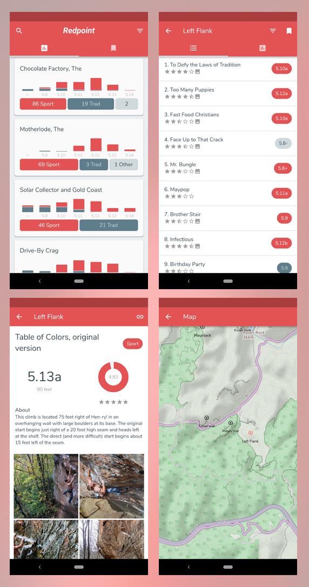

# Redpoint

## Goal
Create an iOS & Android application to serve as an offline guidebook to the Red River Gorge

## Requirements
- Offline route data
- Cache photos at route & area levels
- Sorting
  - Areas (Alpha, Size)
  - Routes (Alpha, L2R, R2L, Stars, Grade)
- Fast search
- Bookmark areas
- Area directions

## Extras
- Grade distribution histograms
- Sport/Trad route distinction
- Live GPS data

## Installing

This is a [Flutter](https://flutter.dev/docs/get-started/install) app and the data has been neatly packaged into a sqlite database. The database can be found in `RRC-Data/sqlite` as well as `Redpoint-App/assets`.

1. Follow the Flutter installation instructions
2. In `Redpoint-App` do `flutter run --release`

Optionally, you can build the apk for Android and sideload it.

## Screenshots
